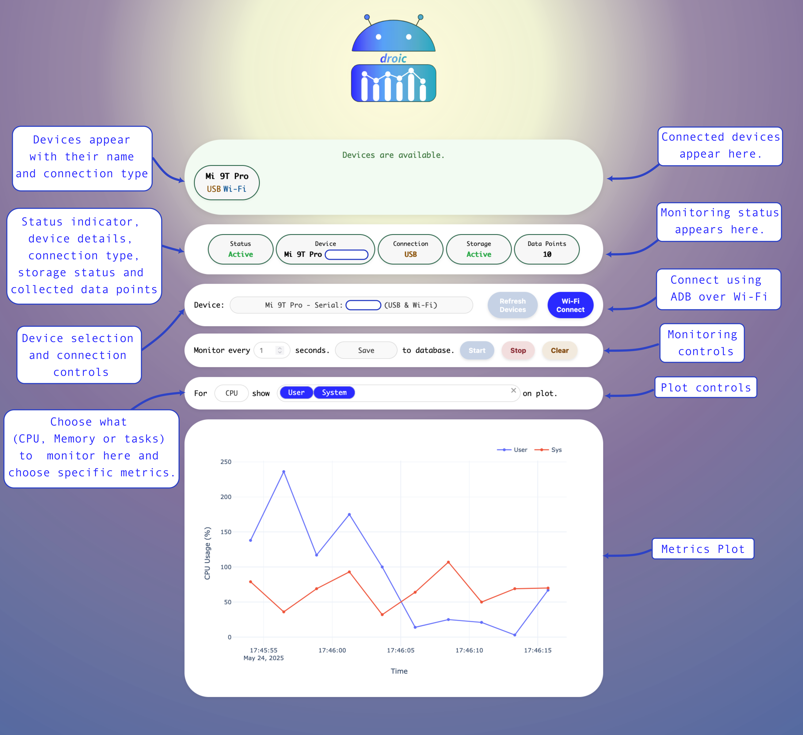

# droic

<div align="center">
  
  <br/>
  <br/>
  
  
  
  
  
  *Monitoring dashboard for android device metrics*
</div>

**Droic** is a Python application that interfaces with Android devices via **ADB** (USB or Wi-Fi) to extract and visualize real-time system metrics like **CPU usage, memory**, and **tasks data**. Built with **Dash** and **Plotly**, it offers a UI and **local SQLite database** logging for historical insights.

---

## ✨ Features

- 🔍 Auto-detects ADB-connected devices via USB or Wi-Fi
- 📡 One-click ADB-over-WiFi connection from the dashboard
- 📊 Live metric visualization (currently supports CPU, memory, tasks)
- 💾 Local SQLite storage with device metadata and timestamps
- 🛎️ In-app notifications for device events and status
- 🧭 Custom monitoring controls:
  - Interval adjustment
  - Metric selection
  - Toggle saving to DB
- 📈 Live plot (latest 100 points) + persistent historical data
- ⚙️ Built using Python, Dash, Plotly, Pandas

---

## 📸 Screenshot

<div>
  
</div>

---

## 🛠️ Getting Started

### ✅ Requirements

- Python 3.11+
- **ADB (Android device Bridge) must installed and added to your system's PATH**
  - Installation of ADB varies according to your operating system. Please follow instructions which apply to your specific operating system.
    - On MacOS, ADB can be installed using homebrew.
      ```bash
      brew install --cask android-platform-tools
      ```
    - On Linux:
      ```bash
      sudo apt install adb
      ```
  - For droic to work, the command `adb` should work.
  - This can be checked easily by executing in a terminal:
      ```bash
      adb --version
      adb devices
      ```
    These should print the ADB version and list connected devices (or start the daemon if not running).
- **Android device(s) with USB debugging enabled.** 
  - For enabling USB-debugging, you would likely have to first enable Developer options on your device.
  - Depending on your device model, this may vary. Please follow instructions specific to your device model.
- **Confirm ADB Authorization on Device**
  - When you connect your device via USB and ADB is initialized, a prompt may appear on your device asking:

    >"Allow USB debugging from this computer?"

  - You must accept this prompt for Droic to function correctly.
  - Optionally check "Always allow from this computer" to avoid repeating this step.
- **Initially, device must be connected via USB.** 
  - Once the USB status shows in droic, you can try connecting via Wi-Fi by clicking on the Wi-Fi Connect button Your device must be connected to same network as the computer on which droic is run.


### 📦 Installation

#### Python

1. Clone this repository
    ```bash
    git clone https://github.com/davistdaniel/droic.git
    cd droic
    ```
2. Make a python virtual environment (recommended) and then install droic dependencies :
    - dash>=3.0.4
    - pandas>=2.2.3
    - plotly>=6.0.1

    ```bash
    python -m pip install -r requirements.txt
    ```
3. Start droic
    ```bash
    python droic.py
    ```

Once running, visit: [http://127.0.0.1:8050](http://127.0.0.1:8050)

---

## 🗃️ Data Storage

All collected data is stored in a local `droic.db` SQLite file. It includes:
- Timestamps
- CPU & memory metrics
- Number of active tasks
- Device model and serial number

---

## 💻 Compatibility

- Tested on **macOS**  and **Linux (Ubuntu)**
- Expected to work on **Windows**  (ADB & Python must be configured properly)

---

## Supported metrics


## 🤝 Contributing

Contributions, bug reports, and suggestions are welcome!

---

## 📄 License
Copyright (c) 2025 Davis Thomas Daniel

This project is licensed under the [MIT LICENSE](./LICENSE).
